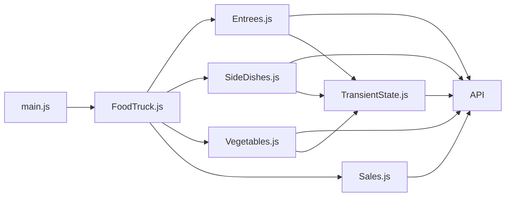

```mermaid
graph LR;
main.js-->FoodTruck.js;
FoodTruck.js-->Entrees.js;
FoodTruck.js-->SideDishes.js;
FoodTruck.js-->Vegetables.js;
FoodTruck.js-->Sales.js;
Entrees.js-->API;
SideDishes.js-->API;
Vegetables.js-->API;
Sales.js-->API;
Entrees.js-->TransientState.js;
SideDishes.js-->TransientState.js;
Vegetables.js-->TransientState.js;
TransientState.js-->API;
```
