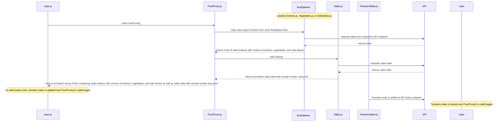

```mermaid
sequenceDiagram;
    participant main.js
    participant FoodTruck.js
    participant foodOptions@{ "type": "collections"}
    participant Sales.js
    participant TransientState.js
    participant API

    note over foodOptions: contains Entrees.js, Vegetables.js, & SideDishes.js

    main.js->>FoodTruck.js: calls FoodTruck()
    FoodTruck.js->>foodOptions: calls main export function from each foodOption files
    foodOptions->>API: requests data from respective API endpoint
    API-->>foodOptions: returns data
    foodOptions-->>FoodTruck.js: returns 3 set of radio buttons with choices of entrees, vegetables, and side dishes
    FoodTruck.js->>Sales.js: calls Sales()
    Sales.js->>API: requests sales data
    API-->>Sales.js: returns sales data
    Sales.js-->>FoodTruck.js: returns formatted sales data with receipt number and price
    FoodTruck.js-->>main.js: returns formatted string of html containing radio buttons with choices of entrees, vegetables, and side dishes as well as sales data with receipt number and price
    note over main.js: on radio button click, transient state is updated and FoodTruck() is called again
    TransientState.js->>API: Transient state is added to API Sales endpoint
    note over main: Transient state is cleared and FoodTruck() is called again
```
